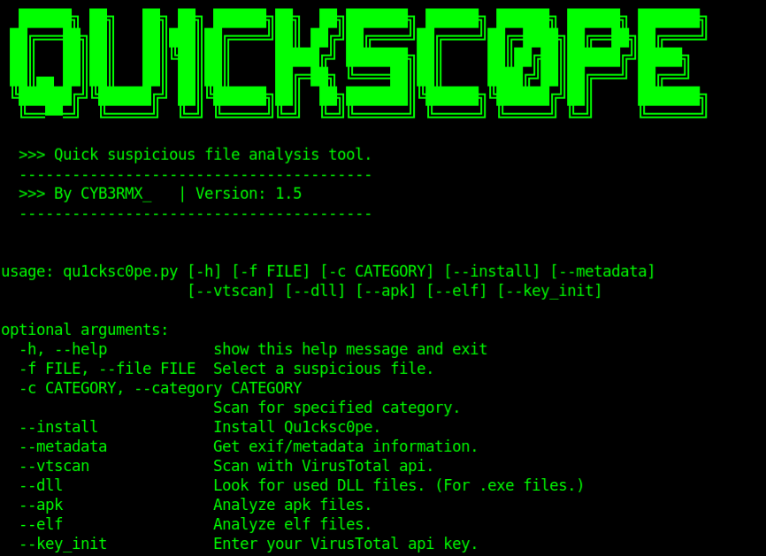

# Qu1cksc0pe
Quick suspicious file static-analysis tool.

- Usage: ```python3 qu1cksc0pe.py --file suspicious_file --scan```
- Alternative usage: ```python3 qu1cksc0pe.py --file [PATH TO FILE] --scan```

# Screenshot


# Scan arguments
<b>----Normal Scan----</b><br>
<b>Usage</b>: ```python3 qu1cksc0pe.py --file suspicious_file --scan```<br><br>

<b>----Metadata----</b><br>
<b>Usage</b>: ```python3 qu1cksc0pe.py --file suspicious_file --metadata```<br><br>

<b>----DLL----</b><br>
<b>Usage</b>: ```python3 qu1cksc0pe.py --file suspicious_file --dll```<br><br>

<b>----VirusTotal----</b><br>
<b>Attention!</b><i> this argument needs VirusTotal api key.</i><br>
<i>To get your api key go to the VT website</i>: <b>https://www.virustotal.com/</b>

<b>Usage</b>: ```python3 qu1cksc0pe.py --file suspicious_file --vtscan```<br>

<b>----APK----</b><br>
<b>Attention!</b><i> this argument needs apktool.</i><br>
<i>To get apktool do this</i>: ```sudo apt-get install apktool``` <i>or<br>
clone that repository and install</i>: <b>https://github.com/iBotPeaches/Apktool</b>

<b>Usage</b>: ```python3 qu1cksc0pe.py --file suspicious_apk_file --apk```<br>

<b>----ELF----</b><br>
<b>Attention!</b><i> this argument needs binutils/readelf.</i><br>
<i>To get binutils/readelf do this</i>: ```sudo apt-get install binutils``` </i><br>

<b>Usage</b>: ```python3 qu1cksc0pe.py --file suspicious_elf_file --elf```<br>
