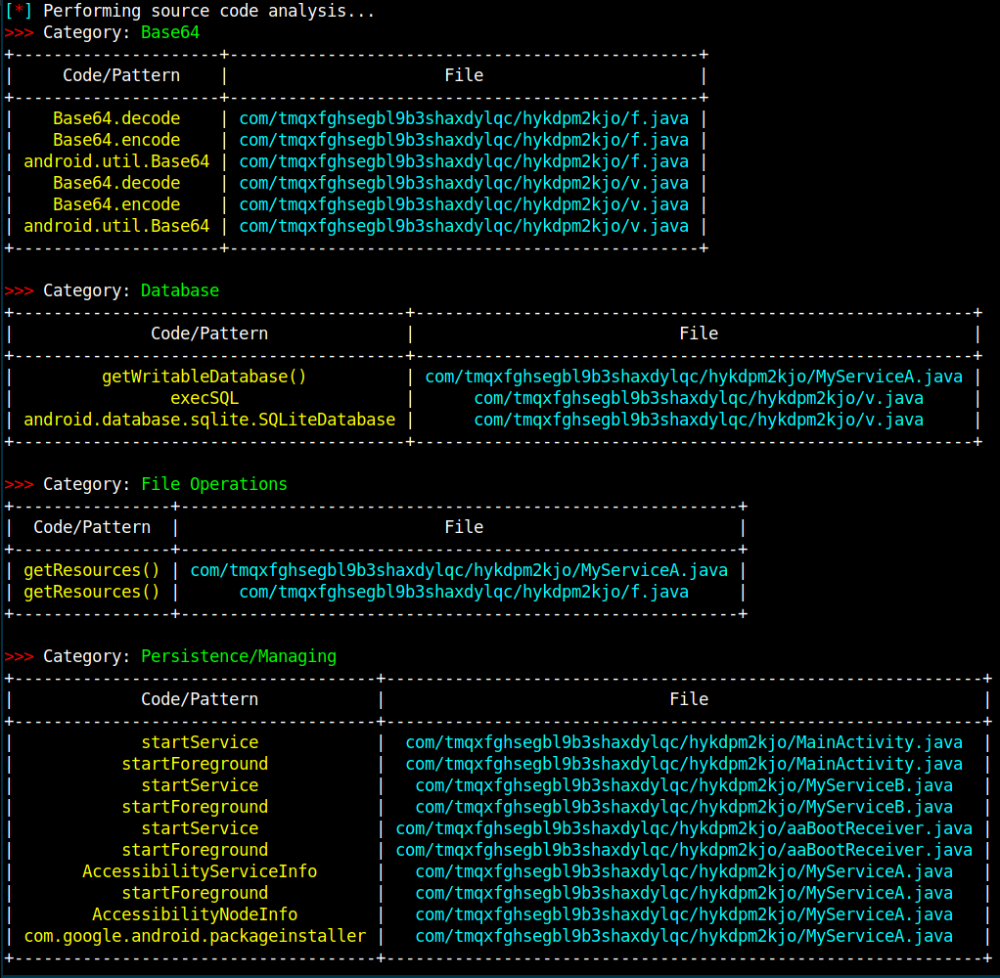
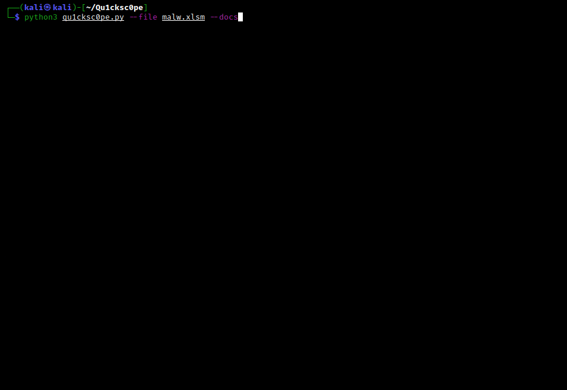
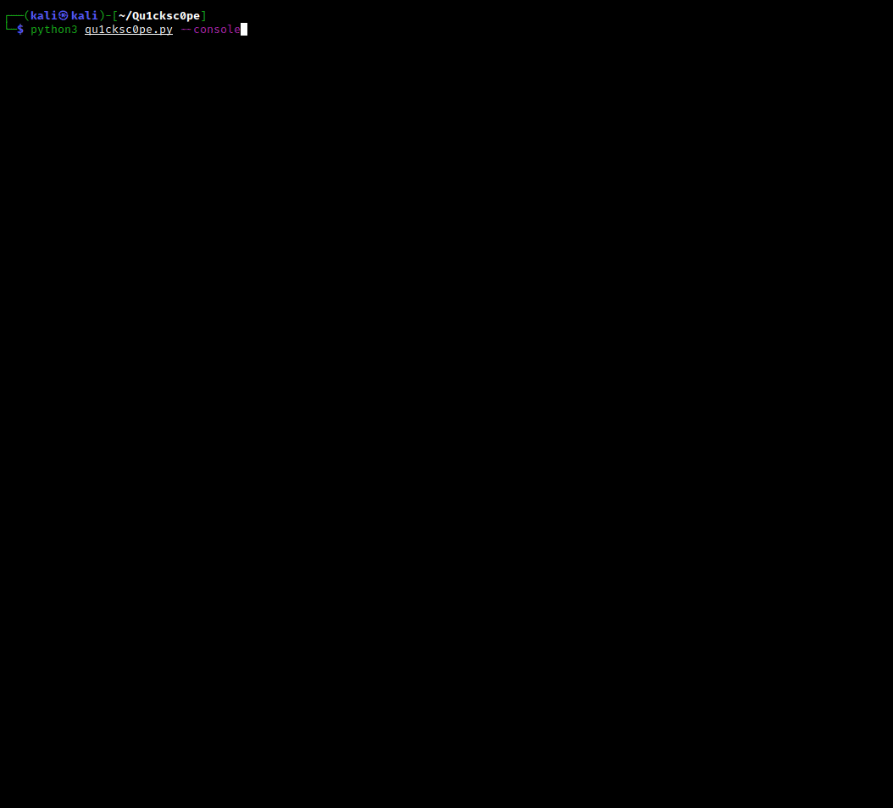

# Qu1cksc0pe
   
<br>This tool allows you to statically analyze Windows, Linux, OSX executables and APK files.<br>

*You can get*: 
- What DLL files are used.
- Functions and APIs.
- Sections and segments.
- URLs, IP addresses and emails.
- Android permissions.
- File extensions and their names.
<br><b>And so on...</b><br>

Qu1cksc0pe aims to get even more information about suspicious files and helps user realize what that file is capable of.

# Usage
```
python3 qu1cksc0pe.py --file suspicious_file --analyze
```

# Screenshot


# Updates
<b>13/10/2021</b>
- [X] Several bug fixes.
- [X] ```VirusTotal module``` is upgraded.<br>


# Available On


# Note
- [X] You can also use Qu1cksc0pe from ```Windows Subsystem Linux``` in Windows 10.

# Setup
<b>Necessary python modules</b>: 
- ```puremagic``` => <i>Analyzing target OS and magic numbers.</i>
- ```androguard``` => <i>Analyzing APK files.</i>
- ```apkid``` => <i>Check for Obfuscators, Anti-Disassembly, Anti-VM and Anti-Debug.</i>
- ```prettytable``` => <i>Pretty outputs.</i>
- ```tqdm``` => <i>Progressbar animation.</i>
- ```colorama``` => <i>Colored outputs.</i>
- ```oletools``` => <i>Analyzing VBA Macros.</i>
- ```pefile``` => <i>Gathering all information from PE files.</i>
- ```quark-engine``` => <i>Extracting IP addresses and URLs from APK files.</i>
- ```pyaxmlparser``` => <i>Gathering informations from target APK files.</i>
- ```yara-python``` => <i>Android library scanning with Yara rules.</i>
- ```prompt_toolkit``` => <i>Interactive shell.</i>
- ```frida``` => <i>Performing dynamic analysis against android applications.</i>

<br><b>Installation of python modules</b>: ```pip3 install -r requirements.txt```<br>
<b>Gathering other dependencies</b>:
- <i>VirusTotal API Key</i>: ```https://virustotal.com```
- <i>Binutils</i>: ```sudo apt-get install binutils```
- <i>ExifTool</i>: ```sudo apt-get install exiftool```
- <i>Strings</i>: ```sudo apt-get install strings```

**Alert**
> **You must specify jadx binary path in Systems/Android/libScanner.conf**
```ini
[Rule_PATH]
rulepath = /Systems/Android/YaraRules/

[Decompiler]
decompiler = JADX_BINARY_PATH <-- You must specify this.
```

# Installation
- [X] You can install Qu1cksc0pe easily on your system. Just execute the following commands.<br>
<b>Command 0</b>: ```sudo pip3 install -r requirements.txt```<br>
<b>Command 1</b>: ```sudo python3 qu1cksc0pe.py --install```

# Scan arguments
## Normal analysis
<b>Usage</b>: ```python3 qu1cksc0pe.py --file suspicious_file --analyze```<br>


## Multiple analysis
<b>Usage</b>: ```python3 qu1cksc0pe.py --multiple FILE1 FILE2 ...```<br>


## Dynamic instrumentation with FRIDA scripts (for android applications)
**Alert**
> **You must connect a virtual device or physical device to your computer.**
<br><b>Usage</b>: ```python3 qu1cksc0pe.py --runtime```<br>


## Hash scan
<b>Usage</b>: ```python3 qu1cksc0pe.py --file suspicious_file --hashscan```<br>


## Folder scan
<b>Supported Arguments</b>:
- ```--hashscan```
- ```--packer```

<b>Usage</b>: ```python3 qu1cksc0pe.py --folder FOLDER --hashscan```<br>


## VirusTotal
<b>Report Contents</b>:
- ```Threat Categories```
- ```Detections```
- ```CrowdSourced IDS Reports```

<b>Usage for --vtFile</b>: ```python3 qu1cksc0pe.py --file suspicious_file --vtFile```<br>


## Document scan
<b>Usage</b>: ```python3 qu1cksc0pe.py --file suspicious_document --docs```<br>


## Programming language detection
<b>Usage</b>: ```python3 qu1cksc0pe.py --file suspicious_executable --lang```<br>


## Interactive shell
<b>Usage</b>: ```python3 qu1cksc0pe.py --console```<br>


## Domain
<b>Usage</b>: ```python3 qu1cksc0pe.py --file suspicious_file --domain```<br><br>

# Informations about categories
## Registry
<b>This category contains functions and strings about:</b>
- Creating or destroying registry keys.
- Changing registry keys and logs.

## File
<b>This category contains functions and strings about:</b>
- Creating/modifying/infecting/deleting files.
- Getting information about file contents and filesystems.

## Networking/Web
<b>This category contains functions and strings about:</b>
- Communicating with malicious hosts.
- Downloading malicious files.
- Sending informations about infected machine and its user.

## Process
<b>This category contains functions and strings about:</b>
- Creating/infecting/terminating processes.
- Manipulating processes.

## Dll/Resource Handling
<b>This category contains functions and strings about:</b>
- Handling DLL files and another malware's resource files.
- Infecting and manipulating DLL files.

## Evasion/Bypassing
<b>This category contains functions and strings about:</b>
- Manipulating Windows security policies and bypassing restrictions.
- Detecting debuggers and doing evasive tricks.

## System/Persistence
<b>This category contains functions and strings about:</b>
- Executing system commands.
- Manipulating system files and system options to get persistence in target systems.

## COMObject
<b>This category contains functions and strings about:</b>
- Microsoft's Component Object Model system.

## Cryptography
<b>This category contains functions and strings about:</b>
- Encrypting and decrypting files.
- Creating and destroying hashes.

## Information Gathering
<b>This category contains functions and strings about:</b>
- Gathering informations from target hosts like process states, network devices etc.

## Keyboard/Keylogging
<b>This category contains functions and strings about:</b>
- Tracking infected machine's keyboard.
- Gathering information about targets keyboard.
- Managing input methods etc.

## Memory Management
<b>This category contains functions and strings about:</b>
- Manipulating and using target machines memory.

# Thanks to
For most of FRIDA scripts: <i>https://github.com/Ch0pin/</i><br>
Another scripts: <i>https://codeshare.frida.re/browse</i>