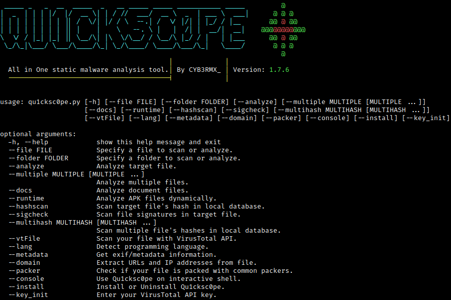
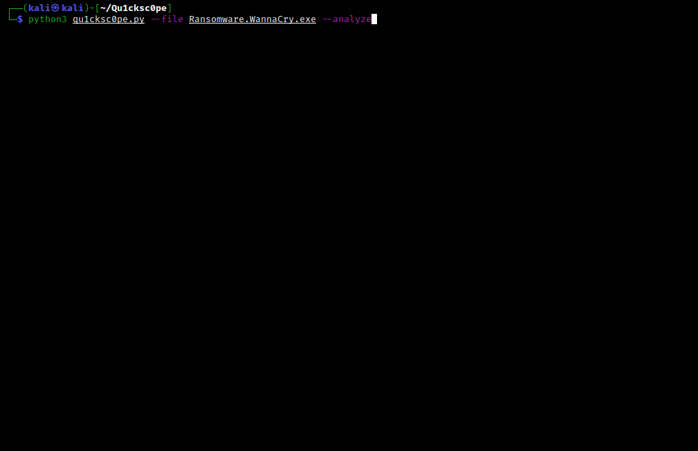
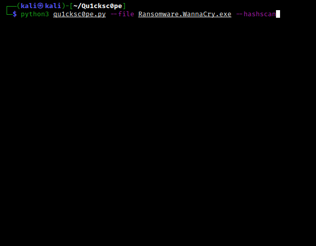
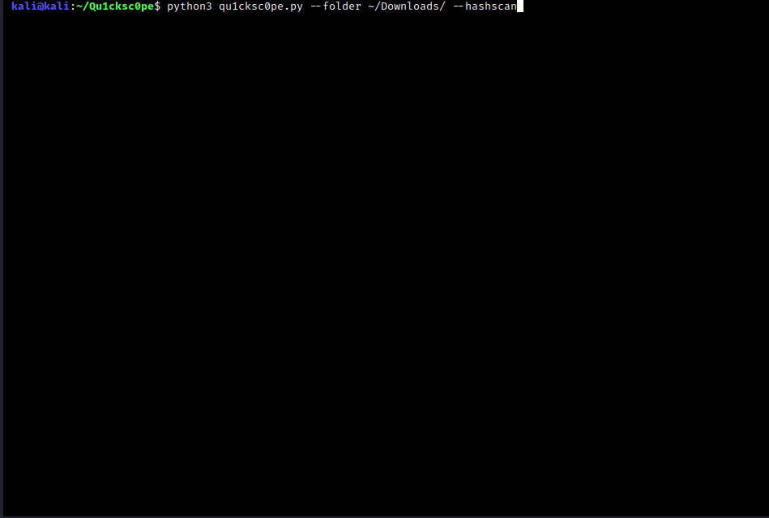
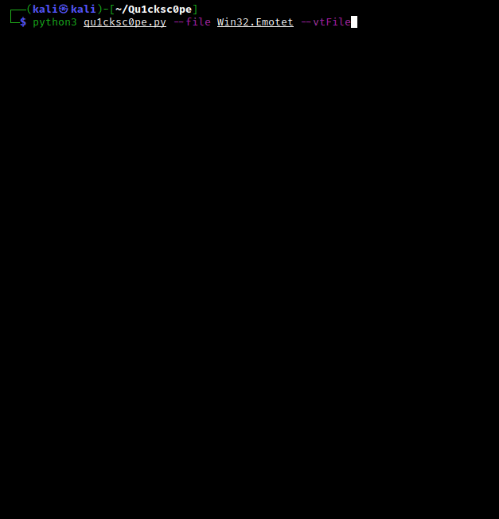

# Qu1cksc0pe
   
<br>This tool allows to statically analyze windows, linux, osx, executables and also APK files.<br>
<i>You can get</i>: 
- What DLL files are used.
- Functions and API's.
- Sections and segments.
- URL's, IP addresses and emails.
- Android permissions.
- File extensions and their names.
<br><b>And so on...</b><br>

Qu1cksc0pe aims to get even more information about suspicious files and helps to user realizing what that file capable of.

- [x] Usage: ```python3 qu1cksc0pe.py --file suspicious_file --analyze```
- [x] Alternative usage: ```python3 qu1cksc0pe.py --file [PATH TO FILE] --analyze```

# Screenshot


# Updates
<b>12/02/2021</b>
- [X] Added ```Language Detection``` module. Now Qu1cksc0pe can detect which programming language used on target binaries.
- <b>Usage</b>: ```python3 qu1cksc0pe.py --file suspicious_executable --lang```

# Note
- [X] You can also use Qu1cksc0pe from ```Windows Subsystem Linux``` in Windows 10.

# Setup
<b>Necessary python modules</b>: 
- ```puremagic``` => <i>Analyzing target OS and magic numbers.</i>
- ```androguard``` => <i>Analyzing APK files.</i>
- ```apkid``` => <i>Check for Anti-VM and Anti-Debug codes.</i>
- ```prettytable``` => <i>Pretty outputs.</i>
- ```tqdm``` => <i>Progressbar animation.</i>
- ```colorama``` => <i>Colored outputs.</i>
- ```oletools``` => <i>Analyzing VBA Macros.</i>
- ```pefile``` => <i>Gathering all information from PE files.</i>
- ```spacy``` => <i>Natural Language Processing for string analysis.</i>

<br><b>Installation of python modules</b>: ```pip3 install -r requirements.txt```<br>
<b>Gathering other dependencies</b>:
- <i>VirusTotal API Key</i>: ```https://virustotal.com```
- <i>Binutils</i>: ```sudo apt-get install binutils```
- <i>ExifTool</i>: ```sudo apt-get install exiftool```
- <i>Strings</i>: ```sudo apt-get install strings```

# Scan arguments
## Normal analysis
<b>Usage</b>: ```python3 qu1cksc0pe.py --file suspicious_file --analyze```<br>


## Multiple analysis
<b>Usage</b>: ```python3 qu1cksc0pe.py --multiple FILE1 FILE2 ...```<br>


## Hash scan
<b>Usage</b>: ```python3 qu1cksc0pe.py --file suspicious_file --hashscan```<br>


## Folder scan
<b>Supported Arguments</b>:
- ```--hashscan```
- ```--packer```

<b>Usage</b>: ```python3 qu1cksc0pe.py --folder FOLDER --hashscan```<br>


## VirusTotal
<b>Usage for --vtFile</b>: ```python3 qu1cksc0pe.py --file suspicious_file --vtFile```<br>
<b>Usage for --vtUrl</b>: ```python3 qu1cksc0pe.py --vtUrl```<br>


## Domain
<b>Usage</b>: ```python3 qu1cksc0pe.py --file suspicious_file --domain```<br>

## Programming language
<b>Usage</b>: ```python3 qu1cksc0pe.py --file suspicious_executable --lang```<br><br>

# Informations about categories
## Registry
<b>This category contains functions and strings about:</b>
- Creating or destroying registry keys.
- Changing registry keys and registry logs.

## File
<b>This category contains functions and strings about:</b>
- Creating/changing/infecting/deleting files.
- Getting informations about file contents and file systems.

## Networking/Web
<b>This category contains functions and strings about:</b>
- Communicating malicious hosts.
- Download malicious files.
- Sending informations about infected machine and its user.

## Process
<b>This category contains functions and strings about:</b>
- Creating/infecting/terminating processes.
- Manipulating processes.

## Dll/Resource Handling
<b>This category contains functions and strings about:</b>
- Handling DLL files and another malware's resource files.
- Infecting and manipulating DLL files.

## Evasion/Bypassing
<b>This category contains functions and strings about:</b>
- Manipulating Windows security policies and bypassing restrictions.
- Detecting debuggers and doing evasive tricks.

## System/Persistence
<b>This category contains functions and strings about:</b>
- Executing system commands.
- Manipulating system files and system options to get persistence in target systems.

## COMObject
<b>This category contains functions and strings about:</b>
- Microsoft's Component Object Model system.

## Cryptography
<b>This category contains functions and strings about:</b>
- Encrypting and decrypting files.
- Creating and destroying hashes.

## Information Gathering
<b>This category contains functions and strings about:</b>
- Gathering all informations from target hosts. Like process states, network devices etc.

## Keyboard/Keylogging
<b>This category contains functions and strings about:</b>
- Tracking infected machine's keyboard.
- Gathering information about targets keyboard.
- Managing input methods etc.

## Memory Management
<b>This category contains functions and strings about:</b>
- Manipulating and using target machines memory.
