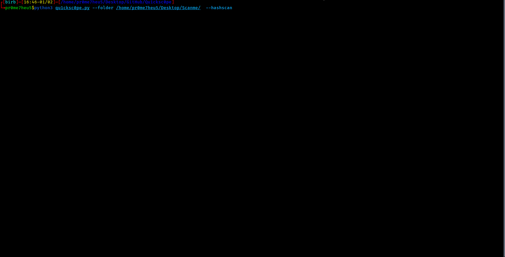
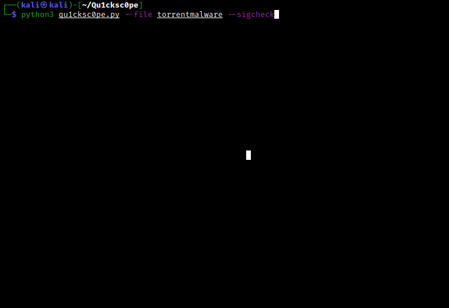

# Qu1cksc0pe
   
<br>This tool allows you to statically analyze Windows, Linux, OSX executables and APK files.<br>

You can get: 
- What DLL files are used.
- Functions and APIs.
- Sections and segments.
- URLs, IP addresses and emails.
- Android permissions.
- File extensions and their names.
<br><b>And so on...</b><br>

Qu1cksc0pe aims to get even more information about suspicious files and helps user realize what that file is capable of.

# Usage
```
python3 qu1cksc0pe.py --file suspicious_file --analyze
```

# Screenshot


# Updates
**01/02/2022**
- [X] Added new ```YARA``` rules for malware detection to ```WindowsAnalyzer``` module.
- [X] ```Interactive Shell Mode``` is upgraded.
- [X] ```VirusTotal API Scanner``` module is upgraded.
- [X] Added TUI to ```HashScanner```. Now folder scans are way more effective.<br>


# Available On


# Note
- You can also use Qu1cksc0pe from ```Windows Subsystem Linux``` in Windows 10.

# Setup
**Necessary python modules**: 
- ```puremagic``` => *Analyzing target OS and magic numbers.*
- ```androguard``` => *Analyzing APK files.*
- ```apkid``` => *Check for Obfuscators, Anti-Disassembly, Anti-VM and Anti-Debug.*
- ```rich``` => *Pretty outputs and TUI.*
- ```tqdm``` => *Progressbar animation.*
- ```colorama``` => *Colored outputs.*
- ```oletools``` => *Analyzing VBA Macros.*
- ```pefile``` => *Gathering all information from PE files.*
- ```quark-engine``` => *Extracting IP addresses and URLs from APK files.*
- ```pyaxmlparser``` => *Gathering informations from target APK files.*
- ```yara-python``` => *Android library scanning with Yara rules.*
- ```prompt_toolkit``` => *Interactive shell.*
- ```frida``` => *Performing dynamic analysis against android applications.*
- ```PyExifTool``` => *Metadata extraction and analysis.*

**Gathering other dependencies**:
- *VirusTotal API Key*: ```https://virustotal.com```
- *Binutils*: ```sudo apt-get install binutils```
- *Strings*: ```sudo apt-get install strings```

**Alert**
> **You must specify jadx binary path in Systems/Android/libScanner.conf**
```ini
[Rule_PATH]
rulepath = /Systems/Android/YaraRules/

[Decompiler]
decompiler = JADX_BINARY_PATH <-- You must specify this.
```

# Installation
You can install Qu1cksc0pe easily on your system. Just execute the following commands.<br>
```bash
sudo pip3 install -r requirements.txt
sudo python3 qu1cksc0pe.py --install
```

# Scan arguments
## Normal analysis
**Usage**: ```python3 qu1cksc0pe.py --file suspicious_file --analyze```<br>


## Resource analysis
**Usage**: ```python3 qu1cksc0pe.py --file suspicious_file --resource```<br>


## Dynamic instrumentation with FRIDA scripts (for android applications)
**Alert**
> **You must connect a virtual device or physical device to your computer.**

<br>**Usage**: ```python3 qu1cksc0pe.py --runtime```<br>


## Hash scan
**Usage**: ```python3 qu1cksc0pe.py --file suspicious_file --hashscan```<br>


## Folder scan
**Supported Arguments**:
- ```--hashscan```
- ```--packer```

**Usage**: ```python3 qu1cksc0pe.py --folder FOLDER --hashscan```<br>


## VirusTotal
**Report Contents**:
- ```Threat Categories```
- ```Detections```
- ```CrowdSourced IDS Reports```

**Usage for --vtFile**: ```python3 qu1cksc0pe.py --file suspicious_file --vtFile```<br>


## Document scan
**Usage**: ```python3 qu1cksc0pe.py --file suspicious_document --docs```<br>


## File signature analyzer
**Usage**: ```python3 qu1cksc0pe.py --file suspicious_file --sigcheck```<br>


## Programming language detection
**Usage**: ```python3 qu1cksc0pe.py --file suspicious_executable --lang```<br>


## Interactive shell
**Usage**: ```python3 qu1cksc0pe.py --console```<br>


## Domain
**Usage**: ```python3 qu1cksc0pe.py --file suspicious_file --domain```<br><br>

# Informations about categories
## Registry
**This category contains functions and strings about:**
- Creating or destroying registry keys.
- Changing registry keys and logs.

## File
**This category contains functions and strings about:**
- Creating/modifying/infecting/deleting files.
- Getting information about file contents and filesystems.

## Networking/Web
**This category contains functions and strings about:**
- Communicating with malicious hosts.
- Downloading malicious files.
- Sending informations about infected machine and its user.

## Process
**This category contains functions and strings about:**
- Creating/infecting/terminating processes.
- Manipulating processes.

## Dll/Resource Handling
**This category contains functions and strings about:**
- Handling DLL files and another malware's resource files.
- Infecting and manipulating DLL files.

## Evasion/Bypassing
**This category contains functions and strings about:**
- Manipulating Windows security policies and bypassing restrictions.
- Detecting debuggers and doing evasive tricks.

## System/Persistence
**This category contains functions and strings about:**
- Executing system commands.
- Manipulating system files and system options to get persistence in target systems.

## COMObject
**This category contains functions and strings about:**
- Microsoft's Component Object Model system.

## Cryptography
**This category contains functions and strings about:**
- Encrypting and decrypting files.
- Creating and destroying hashes.

## Information Gathering
**This category contains functions and strings about:**
- Gathering informations from target hosts like process states, network devices etc.

## Keyboard/Keylogging
**This category contains functions and strings about:**
- Tracking infected machine's keyboard.
- Gathering information about targets keyboard.
- Managing input methods etc.

## Memory Management
**This category contains functions and strings about:**
- Manipulating and using target machines memory.

# Thanks to
For most of FRIDA scripts: *https://github.com/Ch0pin/*

Another scripts: *https://codeshare.frida.re/browse*
