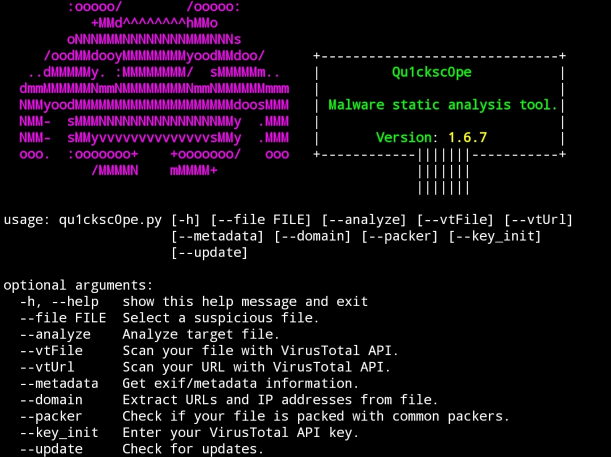

# Qu1cksc0pe


<br>This tool allows to analyze windows, linux executables and also APK files.<br>
You can get used dll files, functions, sections, segments, urls, domains and permissions from your suspicious files.<br>
Qu1cksc0pe aims to get even more information about suspicious files and helps to user realizing what that file capable of.

- [x] Usage: ```python3 qu1cksc0pe.py --file suspicious_file --analyze```
- [x] Alternative usage: ```python3 qu1cksc0pe.py --file [PATH TO FILE] --analyze```

# Screenshot


# Updates
<b>15/08/2020</b>
- [X] Added more Windows Functions/API's.
- [X] Removed threat score table.
- [X] Fixed minor bugs.
- [X] ```--url``` argument renamed to ```--domain```. Now you can be able to extract IP addresses from files.

# Setup
<b>Necessary python modules</b>: ```puremagic``` and ```androguard```<br>
<b>Installation of python modules</b>: ```pip install -r requirements.txt```<br>
<b>Other dependencies</b>: ```VirusTotal API key```, ```binutils``` and ```exiftool```<br>
<b>Gathering other dependencies<b>
- <i>VirusTotal</i>: ```https://virustotal.com```
- <i>Binutils</i>: ```sudo apt-get install binutils```
- <i>ExifTool</i>: ```sudo apt-get install exiftool```

# Scan arguments
## Normal analysis
<b>Usage</b>: ```python3 qu1cksc0pe.py --file suspicious_file --analyze```<br>


## VirusTotal
<b>Usage for --vtFile</b>: ```python3 qu1cksc0pe.py --file suspicious_file --vtFile```<br>
<b>Usage for --vtUrl</b>: ```python3 qu1cksc0pe.py --vtUrl```<br>


## Domain
<b>Usage</b>: ```python3 qu1cksc0pe.py --file suspicious_file --domain```<br><br>

