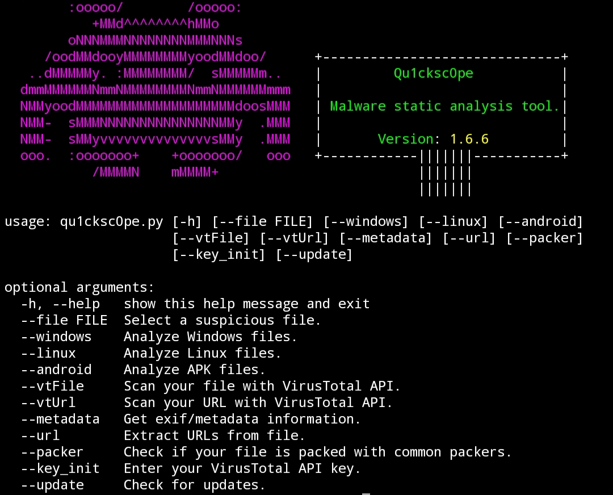
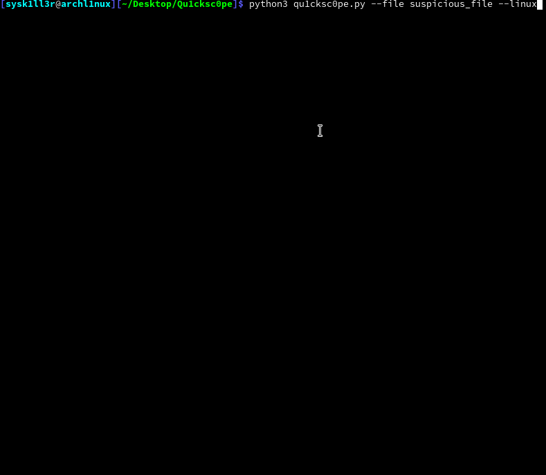
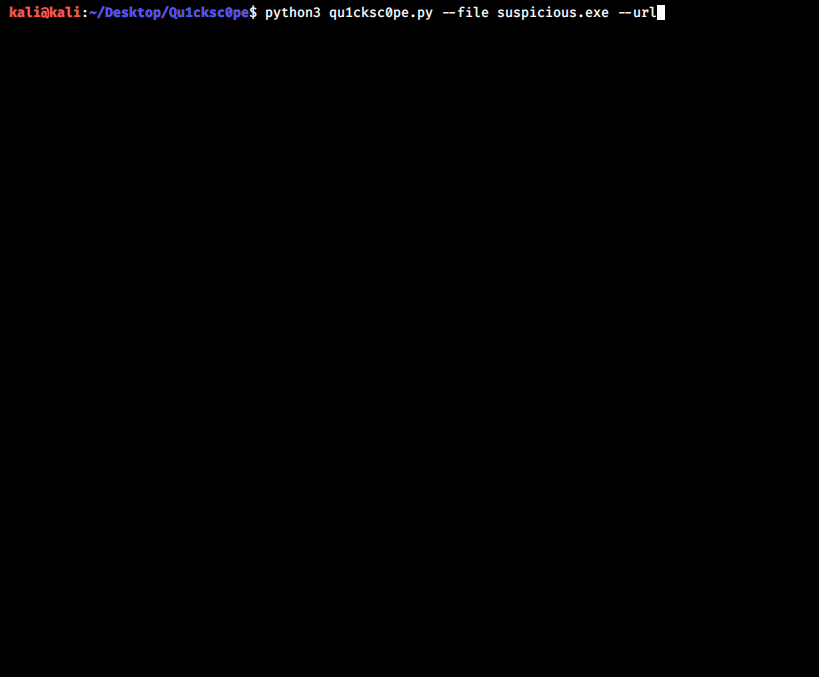

# Qu1cksc0pe

[](https://www.python.org/)

[](https://opensource.org/licenses/Apache-2.0)
<br>This tool allows to analyze windows and linux executables.<br>
You can get used dll files, functions, sections, segments, urls and domains from your suspicious files.<br>
Qu1cksc0pe aims to get even more information about suspicious files and helps to user realizing what that file capable of.

- [x] Usage: ```python3 qu1cksc0pe.py --file suspicious_file --windows/--linux```
- [x] Alternative usage: ```python3 qu1cksc0pe.py --file [PATH TO FILE] --windows/--linux```

# Screenshot


# Updates
- [x] <b>23/06/2020</b>: Bug fixes.

# Scan arguments
## Windows Scan
<b>Usage</b>: ```python3 qu1cksc0pe.py --file suspicious_file --windows```<br><br>


## Linux Scan
<b>Attention!</b><i> this argument needs binutils/readelf.</i><br>
<i>To get binutils/readelf do this</i>: ```sudo apt-get install binutils``` </i><br>

<b>Usage</b>: ```python3 qu1cksc0pe.py --file suspicious_file --linux```<br>


## VirusTotal
<b>Attention!</b><i> this argument needs VirusTotal api key.</i><br>
<i>To get your api key go to the VT website</i>: <b>https://www.virustotal.com/</b>

<b>Usage for --vtFile</b>: ```python3 qu1cksc0pe.py --file suspicious_file --vtFile```<br>
<b>Usage for --vtUrl</b>: ```python3 qu1cksc0pe.py --vtUrl```<br>


## URL
<b>Usage</b>: ```python3 qu1cksc0pe.py --file suspicious_file --url```<br><br>


# Can you buy me a coffee m8 :) ?
<b>My BTC address</b>: <i>3CURiEGSTUyQPrQuVG2v4Uo6vVjaQBp24v</i>
